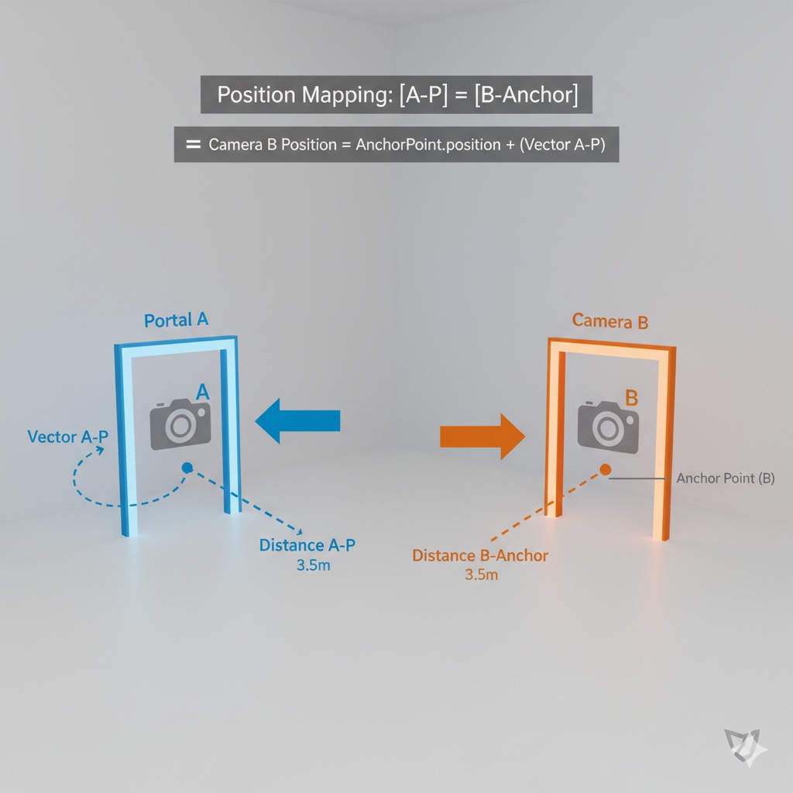

# Unity 虛擬傳送門系統 (Virtual Portal System)

[English Version](#english-version)

[直接下載腳本](https://raw.githubusercontent.com/LunarLunar/Unity-Quaternion-Portal/main/PortalCam.cs) 

這是一個專為 Unity 3D 設計的 C# 腳本，用於實現**虛擬傳送門 (Virtual Portal)** 的視覺效果。

本系統的核心在於利用 **Quaternion (四元數)** 數學和 **Transform 座標轉換**，確保輔助攝影機（Portal Camera）拍攝到的畫面能夠**完美、無縫隙地**同步玩家穿梭於兩個空間時的正確透視、位置和旋轉。

它提供了資源優化的 RenderTexture 管理，並加入了 Z 軸鏡像等可選功能，使其適用於各種標準的傳送門應用場景。

## 核心功能

- **精確的透視校正**: 自動計算並同步主攝影機與輔助攝影機的位置與旋轉，提供無縫的視覺穿越體驗。
- **RenderTexture 管理**: 自動生成與管理用於渲染傳送門畫面的 RenderTexture，並在腳本停用時自動釋放，避免資源洩漏。
- **Z 軸鏡像**: 提供可選的 Z 軸鏡像功能，輕鬆實現「穿透」或「鏡像」兩種不同的視覺效果。
- **高效能**: 程式碼結構清晰，運算集中在 `LateUpdate` 中，確保每一幀都能正確更新攝影機姿態。

## 運作原理

### 1. 位置映射 (Position Mapping)

為了讓傳送門另一端的畫面看起來正確，輔助攝影機 (Portal Camera) 的位置必須根據玩家攝影機 (Main Camera) 相對於「入口傳送門」的位置來動態調整。

其關係如下圖所示：

**圖示說明：**
- **左側 (藍色)**: 代表玩家的主攝影機 (A) 和傳送門 A。`Vector A-P` 表示玩家攝影機相對於傳送門 A 的向量。
- **右側 (橘色)**: 代表輔助攝影機 (B) 和傳送門 B (錨點)。
- **核心理念**: 輔助攝影機 (B) 的位置會被設定成使其與傳送門 B (錨點) 的相對位置，完全等同於主攝影機 (A) 與傳送門 A 的相對位置（已考慮座標系轉換）。

### 2. 旋轉與鏡像映射 (Rotation & Mirror Mapping)

輔助攝影機的旋轉不僅取決於玩家攝影機的旋轉，還必須加上兩個傳送門之間的旋轉差，才能確保畫面的方向正確。

**圖示說明：**
- **頂視圖 (Orthographic Top-Down)**: 簡化展示 Y 軸旋轉的映射。
- **旋轉映射**: 輔助攝影機 (B) 的最終旋轉 = 玩家攝影機 (A) 的旋轉 + 傳送門 B 相對於傳送門 A 的旋"轉差。
- **Z 軸鏡像 (`enableMirrorZ`)**:
  - `false` (如圖示): 輔助攝影機的 Z 軸方向與玩家攝影機轉換後的方向一致，適用於「看穿」效果。
  - `true`: 輔助攝影機的局部 Z 軸會反轉 180 度，產生鏡像效果。

## 如何使用

1.  將 [`PortalCam.cs`](https://raw.githubusercontent.com/LunarLunar/Unity-Quaternion-Portal/main/PortalCam.cs) 腳本附加到您的**輔助攝影機 (Portal Camera)** 上。
2.  在 Inspector 面板中，設定以下參數：
    - **`playerCamera` (玩家的攝影機)**: 指定玩家的主攝影機 (Main Camera)。
    - **`portal_FrontPlayer` (玩家前方的傳送門 A)**: 指定入口傳送門的 Transform。
    - **`AnchorPoint` (照準點 / 傳送門 B)**: 指定出口傳送門的 Transform。
    - **`cameraMatB` (動態產生新Portal材質)**: 指定用於顯示傳送門畫面的材質 (Material)。腳本會自動將渲染畫面指派給此材質。
    - **`enableMirrorZ`**: 根據需求勾選是否啟用 Z 軸鏡像。
    - **`invertYRotation`**: 如果傳送門畫面出現上下顛倒的情況，請勾選此項。
3.  確保您的輔助攝影機 (`camB`) 和 `cameraMatB` 所用的 Shader 能正確處理 `RenderTexture`。

---

# English Version

## Unity Virtual Portal System
[Download Script](https://raw.githubusercontent.com/LunarLunar/Unity-Quaternion-Portal/main/PortalCam.cs) 

The core of this system lies in the use of **Quaternion** mathematics and **Transform coordinate conversion**. It ensures that the view captured by the portal camera perfectly and seamlessly synchronizes the correct perspective, position, and rotation as the player moves between two spaces.

It features optimized RenderTexture management and includes optional functionalities like Z-axis mirroring, making it suitable for various standard portal application scenarios.

### Core Features

- **Precise Perspective Correction**: Automatically calculates and synchronizes the position and rotation of the main and portal cameras to provide a seamless visual transition.
- **RenderTexture Management**: Automatically generates and manages the RenderTexture for the portal view and releases it when the script is disabled to prevent memory leaks.
- **Z-axis Mirroring**: Provides an optional Z-axis mirroring feature to easily achieve either a "see-through" or "mirror" visual effect.
- **High Performance**: The code is well-structured, with calculations concentrated in `LateUpdate` to ensure the camera posture is correctly updated every frame.

### How It Works

#### 1. Position Mapping

To make the view from the other side of the portal appear correct, the position of the Portal Camera must be dynamically adjusted based on the Main Camera's position relative to the entrance portal.

The relationship is illustrated below:

**Diagram Explanation:**
- **Left Side (Blue)**: Represents the player's Main Camera (A) and Portal A. `Vector A-P` is the vector from Portal A to the Main Camera.
- **Right Side (Orange)**: Represents the Portal Camera (B) and Portal B (the anchor).
- **Core Concept**: The position of Camera B is set so that its positional relationship with Portal B is identical to the relationship between Camera A and Portal A, taking into account the transformation between coordinate systems.

#### 2. Rotation & Mirror Mapping

The rotation of the portal camera depends not only on the player camera's rotation but also on the rotational difference between the two portals.

**Diagram Explanation:**
- **Top-Down View**: A simplified illustration of the rotation mapping on the Y-axis.
- **Rotation Mapping**: The final rotation of the Portal Camera (B) = Main Camera's (A) Rotation + Rotational difference between Portal B and Portal A.
- **Z-axis Mirroring (`enableMirrorZ`)**:
  - `false` (as shown): The Z-axis of the portal camera aligns with the transformed direction of the player camera, suitable for a "see-through" effect.
  - `true`: The local Z-axis of the portal camera is rotated 180 degrees, creating a mirror effect.

### How to Use

1.  Attach the `[`PortalCam.cs`](https://raw.githubusercontent.com/LunarLunar/Unity-Quaternion-Portal/main/PortalCam.cs)` script to your **Portal Camera**.
2.  In the Inspector, configure the following parameters:
    - **`playerCamera` (Player's Camera)**: Assign the player's main camera.
    - **`portal_FrontPlayer` (Portal A in front of Player)**: Assign the Transform of the entrance portal.
    - **`AnchorPoint` (Anchor / Portal B)**: Assign the Transform of the exit portal.
    - **`cameraMatB` (Material for Portal)**: Assign the material used to display the portal's view. The script will automatically assign the rendered view to this material.
    - **`enableMirrorZ`**: Check this box if you need Z-axis mirroring.
    - **`invertYRotation`**: If the portal view appears upside down, check this box.
3.  Ensure that your portal camera (`camB`) and the shader used by `cameraMatB` can correctly handle the `RenderTexture`.
